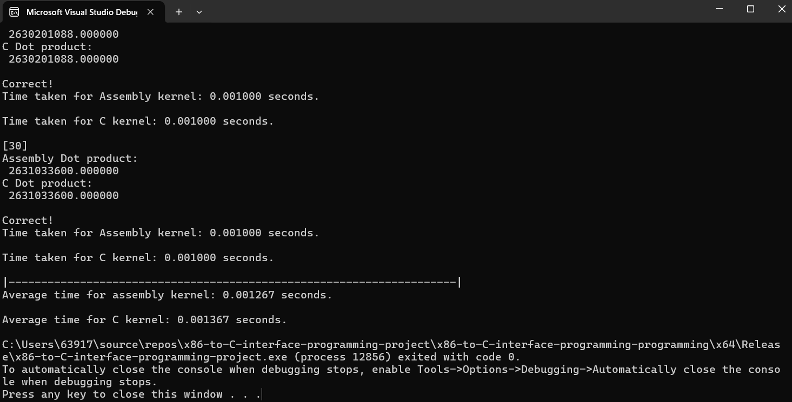
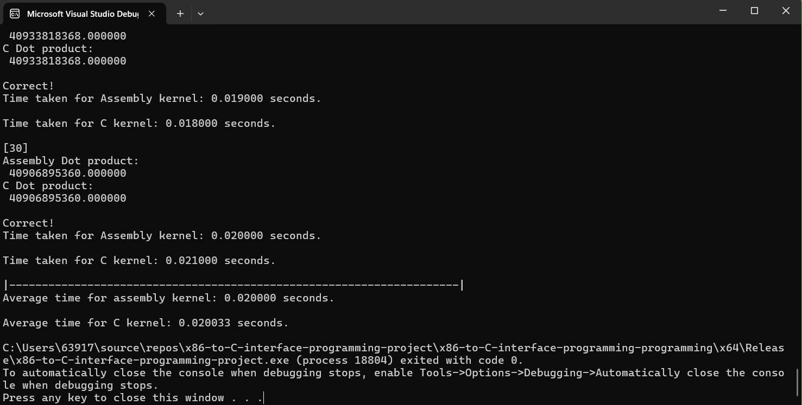
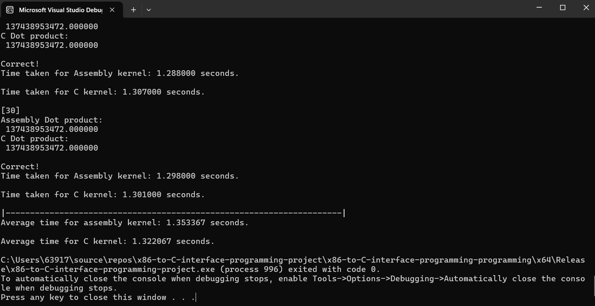

# x86-to-C Interface Programming Project
Joshua Emmanuel G. Tipon  
LBYARCH2 XX22 - Hiroki Asaba
## Average Execution Time Of Each Vector Size: 2^20, 2^24, and 2^30
30 runs of the program were executed to get the average execution time of each kernel of each size and each version.

### Debug Version
| Vector Size | Assembly Kernel | C Kernel |
| --- | --- | --- |
| **2^20** | 0.001300 | 0.002567 |
| **2^24** | 0.020233 | 0.044133 |
| **2^30** | 1.332500 | 2.793433 |

### Release Version
| Vector Size | Assembly Kernel | C Kernel |
| --- | --- | --- |
| **2^20** | 0.001267 | 0.001367 |
| **2^24** | 0.020000 | 0.020033 |
| **2^30** | 1.353367 | 1.322067 |

## Comparative Execution Time and Short Analysis of the Performance of the Kernels
Based on the results gatheres through the executions, we were able to learn that the Assembly Kernel were generally faster than the C Kernel in both debug and release versions, with the release version of the vector size of 2^30 being an outlier where the C Kernel was faster than the Assembly Kernel by 0.0313 seconds.

## Screenshot of the Program Output With The Correctness Check (C).
### Debug Versions
2^20

2^24

2^30

# Release Versions
2^20

2^24

2^30

